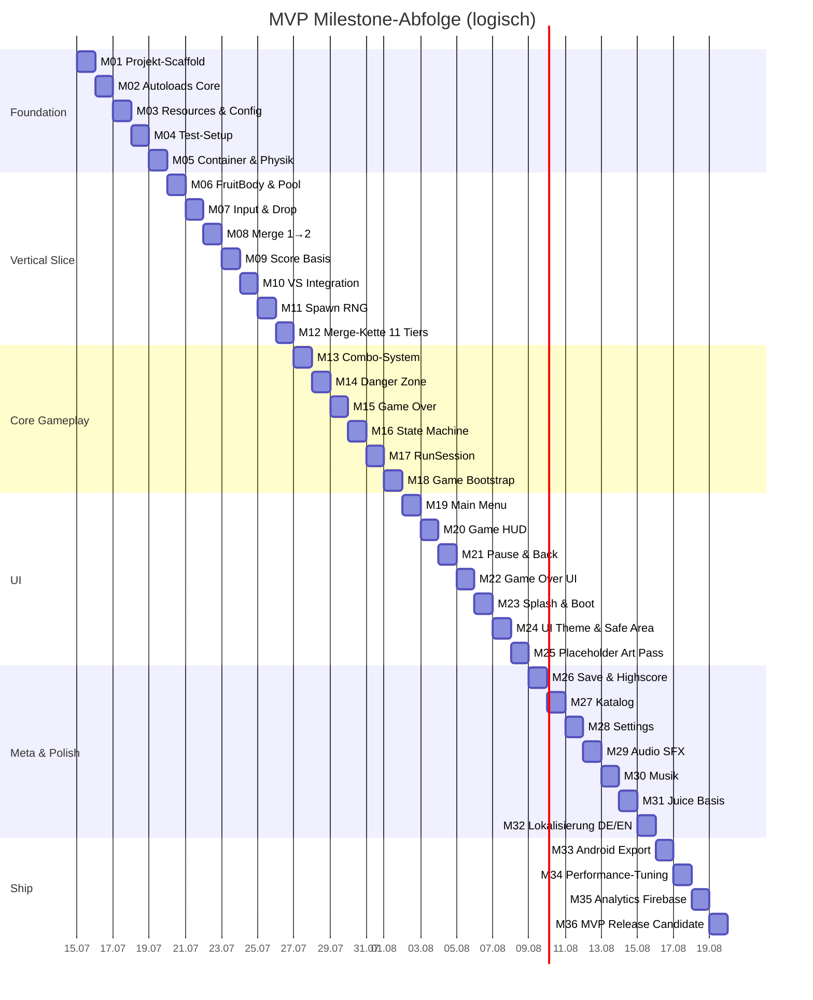
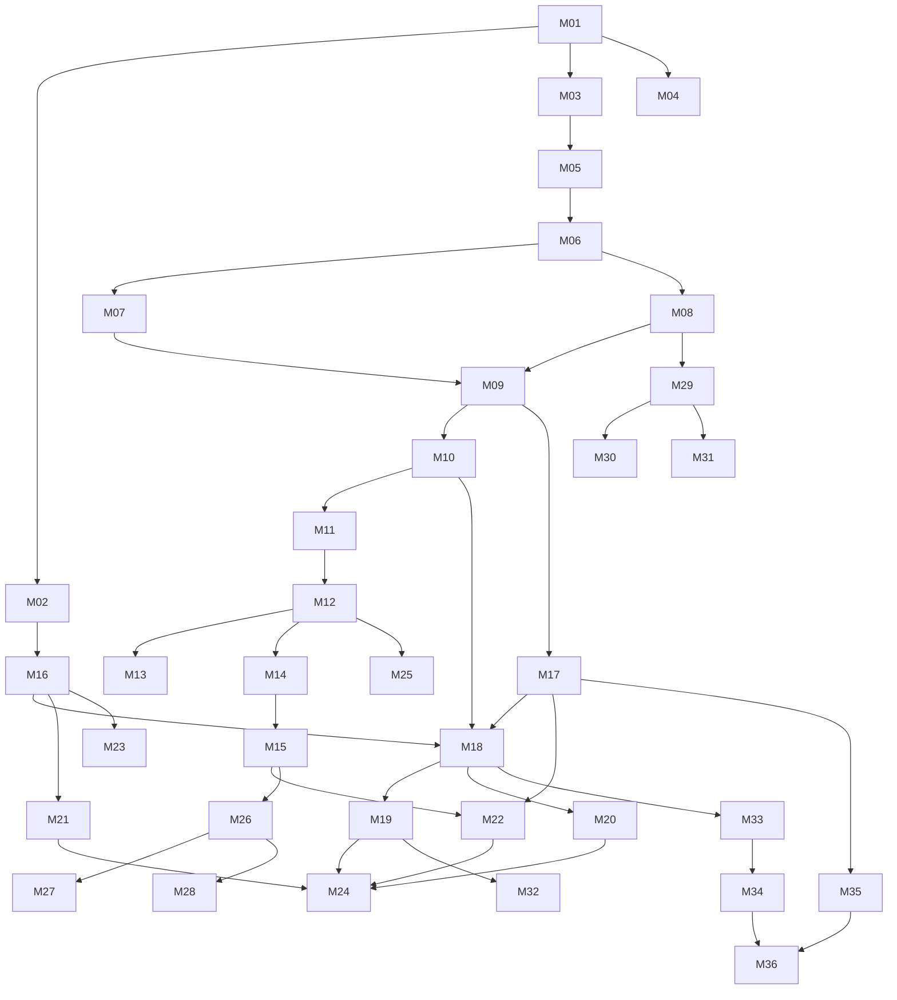

# Milestone-Plan — Frucht Kombinierer

| | |
|---|---|
| **Rolle** | Technical Lead |
| **Basis** | [PRD](./PRD.md) · [TDD](./TDD.md) · [SETUP](./SETUP.md) |
| **Scope** | MVP (Godot 4, Android) |
| **Größe** | Max. **1 Arbeitstag** (~6–8 h) pro Milestone |
| **Stand** | 14. Juli 2026 — M01–M04, M16 erledigt |

---

## Übersicht

| Phase | Milestones | Arbeitstage | Fortschritt |
|-------|------------|-------------|-------------|
| 0 — Foundation | M01–M05 | 5 | M01–M04 ✅ |
| 1 — Vertical Slice | M06–M12 | 7 | — |
| 2 — Core Gameplay | M13–M18 | 6 | M16 ✅ |
| 3 — Game Flow & UI | M19–M25 | 7 | — |
| 4 — Meta & Polish | M26–M32 | 7 | — |
| 5 — Ship MVP | M33–M36 | 4 | — |
| **Gesamt** | **36 Milestones** | **~36 Tage** | **5/36** |



---

## Phase 0 — Foundation

### M01 — Godot-Projekt-Scaffold ✅

| | |
|---|---|
| **Status** | ✅ Erledigt (14.07.2026) |
| **Ziel** | Lauffähiges Godot-4-Projekt mit Ordnerstruktur, `project.godot` und Portrait-Konfiguration |
| **Abhängigkeiten** | Godot 4.x installiert ([SETUP](./SETUP.md)) |
| **Akzeptanzkriterien** | Projekt öffnet fehlerfrei; Portrait 9:16; Physics 60 Hz; Mobile Renderer; Ordner laut TDD §20 vorhanden |
| **Risiken** | Godot-Version inkonsistent → Version in `project.godot` + README pinnen |
| **Tests** | Projekt startet ohne Errors im Output-Panel |
| **DoD** | `project.godot` committed; leere `boot.tscn` als Main Scene; CI-taugliche Struktur |

**Checkliste**

- [x] Godot 4.x installiert (4.7 via winget)
- [x] `project.godot` — Portrait 720×1280, `canvas_items` + `expand`, Physics 60 Hz, Mobile Renderer
- [x] Godot-Version in `project.godot` (`4.3`) und README gepinnt
- [x] Ordnerstruktur laut TDD §20 (`scenes/`, `scripts/`, `resources/`, `assets/`, `tests/`)
- [x] `scenes/boot/boot.tscn` als Main Scene (Smoke-Label)
- [x] `icon.svg` Placeholder-Icon
- [x] GitHub-Skripte nach `tooling/` migriert; `scripts/` für GDScript frei
- [x] Projekt öffnet fehlerfrei im Godot Editor
- [x] Headless-Start ohne Errors (`--headless --quit-after 1`)
- [x] README + SETUP mit Start-Anleitung aktualisiert

---

### M02 — Autoloads Core ✅

| | |
|---|---|
| **Status** | ✅ Abgeschlossen (14.07.2026) |
| **Ziel** | `EventBus`, `FeatureFlags`, `SaveService` (Stub) als Autoloads registrieren |
| **Abhängigkeiten** | M01 |
| **Akzeptanzkriterien** | Autoloads in Project Settings sichtbar; `EventBus.emit/subscribe` funktioniert; `FeatureFlags.is_enabled()` liefert MVP-Defaults |
| **Risiken** | Zirkuläre Autoload-Referenzen → Stubs ohne Cross-Calls |
| **Tests** | Manuell: Test-Script subscribed auf Event, emit löst Callback aus |
| **DoD** | 3 Autoload-Scripts + Registrierung committed |

**Akzeptanz-Verifikation (14.07.2026)**

| Kriterium | Ergebnis | Nachweis |
|-----------|----------|----------|
| Autoloads in Project Settings | ✅ | `[autoload]` in `project.godot`: EventBus, FeatureFlags, SaveService |
| `EventBus.emit` / `subscribe` / `unsubscribe` | ✅ | `boot.gd` Smoke-Test; Callback nach `emit` ausgelöst |
| `FeatureFlags.is_enabled()` MVP-Defaults | ✅ | 5 Flags (`dual_preview`, `pity_spawn`, `daily_challenge`, `achievements`, `share`) → `false`; unbekannte Keys → `false` |
| Manueller Event-Test | ✅ | `boot.gd` subscribed → emit → assert grün |
| DoD: 3 Scripts + Registrierung | ✅ | `event_bus.gd`, `feature_flags.gd`, `save_service.gd` + `project.godot` |
| Keine Cross-Calls zwischen Autoloads | ✅ | Grep: keine gegenseitigen Referenzen in `scripts/autoload/` |
| Headless ohne Errors | ✅ | `Godot 4.7 --headless --quit-after 1` → Exit 0 |

**Checkliste**

- [x] `scripts/autoload/event_bus.gd` — emit/subscribe/unsubscribe
- [x] `scripts/autoload/feature_flags.gd` — MVP-Defaults (alle `false`)
- [x] `scripts/autoload/save_service.gd` — In-Memory-Stub (load/save/get_settings)
- [x] `scripts/persistence/save_data.gd` — Default-Schema TDD §13.1
- [x] `scripts/core/game_events.gd` — Event-Name-Konstanten TDD §7.1
- [x] Autoloads in `project.godot` registriert
- [x] `scenes/boot/boot.gd` — Smoke-Assertions für EventBus, FeatureFlags, SaveService
- [x] Headless-Start ohne Errors (`--headless --quit-after 1`)

---

### M03 — Custom Resources & Config ✅

| | |
|---|---|
| **Status** | ✅ Abgeschlossen (14.07.2026) |
| **Ziel** | `FruitDefinition`, `FruitDatabase`, `SpawnConfig`, `ScoreConfig`, `PhysicsConfig` als `.tres` |
| **Abhängigkeiten** | M01 |
| **Akzeptanzkriterien** | Mind. Tier 1–2 als Resources; Spawn-Gewichte 35/28/20/12/5 %; Score-Tabelle PRD §8.1; Werte im Inspector editierbar |
| **Risiken** | Resource-Klassen nicht registriert → `class_name` setzen |
| **Tests** | Resources laden per `preload()` ohne Fehler |
| **DoD** | `resources/` mit Configs committed; PRD-Werte dokumentiert |

**Checkliste**

- [x] `scripts/resources/` — 5 Resource-Klassen mit `class_name`
- [x] `resources/fruits/fruit_01_cherry.tres` — Tier 1 (radius 18, mass 1.0)
- [x] `resources/fruits/fruit_02_strawberry.tres` — Tier 2 (radius 26, mass 1.4)
- [x] `resources/fruit_database.tres`, `spawn_config.tres`, `score_config.tres`, `physics_config.tres`
- [x] Spawn-Gewichte 35 / 28 / 20 / 12 / 5 (PRD §5.5)
- [x] Score-Tabelle vollständig (PRD §8.1)
- [x] `scenes/boot/boot.gd` — Resource-Preload-Smoke-Assertions
- [x] Headless-Start ohne Errors (`--headless --quit-after 1`)
- [x] SETUP.md — M03 Resource-Dokumentation

---

### M04 — Test-Framework-Setup ✅

| | |
|---|---|
| **Status** | ✅ Abgeschlossen (14.07.2026) |
| **Ziel** | GdUnit4 installieren; erstes EditMode-Test-Skeleton |
| **Abhängigkeiten** | M01 |
| **Akzeptanzkriterien** | `tests/unit/` vorhanden; ein Dummy-Test läuft grün im Godot-Test-Runner |
| **Risiken** | Addon-Version inkompatibel → GdUnit4-Release zu Godot-Version matchen |
| **Tests** | `test_dummy.gd` → `assert_that(true).is_true()` |
| **DoD** | GdUnit4 als Addon committed oder dokumentiert; Test läuft |

**Checkliste**

- [x] `addons/gdUnit4/` — GdUnit4 v6.2 (master) für Godot 4.7 committed
- [x] `project.godot` — Plugin unter `[editor_plugins]` aktiviert
- [x] `tests/unit/test_dummy.gd` — Dummy-Test läuft grün
- [x] Headless-Test via `GdUnitCmdTool.gd -a tests/unit` → Exit 0
- [x] SETUP.md — GdUnit4 Install- und Run-Anleitung

---

### M05 — Container-Szene & Physik-Grenzen

| | |
|---|---|
| **Ziel** | Obstkorb mit `StaticBody2D`-Wänden, Boden, abgerundete Kollision; Danger-Line als `Area2D` |
| **Abhängigkeiten** | M01, M03 |
| **Akzeptanzkriterien** | Container sichtbar (Placeholder-Grafik ok); Boden bounce ~0,3; Wände reflektierend; Danger-Line bei ~85 % Höhe |
| **Risiken** | Kollisionsformen zu glitchy → `CollisionPolygon2D` feinjustieren |
| **Tests** | Test-`RigidBody2D` fällt in Container, prallt an Wänden |
| **DoD** | `scenes/game/container.tscn` committed; PhysicsConfig angewendet |

---

## Phase 1 — Vertical Slice

### M06 — FruitBody & Object Pool

| | |
|---|---|
| **Ziel** | `FruitBody` (RigidBody2D) mit Tier-Daten, `FruitPool` acquire/release |
| **Abhängigkeiten** | M03, M05 |
| **Akzeptanzkriterien** | Pool liefert Tier-1-Frucht; `contact_monitor` aktiv; `continuous_cd` gesetzt; Release gibt Body zurück |
| **Risiken** | Pool-Leak bei Destroy → immer `release()` statt `queue_free()` |
| **Tests** | Unit: Pool acquire 5×, release 5×, Size stabil |
| **DoD** | `fruit_body.tscn` + `fruit_pool.gd` committed |

---

### M07 — Input & Drop-Preview

| | |
|---|---|
| **Ziel** | Touch-Drag horizontal, Ghost-Silhouette, Drop bei Release |
| **Abhängigkeiten** | M05, M06 |
| **Akzeptanzkriterien** | Finger-Drag bewegt Preview entlang Container-Oberkante; Ghost zeigt Landeposition; Release spawnt Frucht |
| **Risiken** | Koordinaten Screen↔World falsch → `Camera2D` + `get_global_mouse_position()` |
| **Tests** | Manuell: 10 Drops an links/rechts/mitte landen korrekt |
| **DoD** | `InputHandler`, `DropPreview`, `DropController` committed |

---

### M08 — MergeService (Tier 1→2)

| | |
|---|---|
| **Ziel** | Zwei gleiche Früchte kollidieren → eine Frucht Tier+1 am Kontaktpunkt |
| **Abhängigkeiten** | M06 |
| **Akzeptanzkriterien** | Kirsche + Kirsche → Erdbeere; `is_merging`-Lock verhindert Doppel-Merge; `merge_started/completed` Events |
| **Risiken** | Race bei schneller Kollision → Lock + Queue (TDD §15) |
| **Tests** | Unit: `can_merge(same,same)=true`, `can_merge(diff)=false`; `try_merge` erzeugt tier+1 |
| **DoD** | `MergeService` + `FruitCollisionHandler` committed |

---

### M09 — ScoreService (Basis)

| | |
|---|---|
| **Ziel** | Punkte bei Merge gemäß `ScoreConfig`; Floating-Score-Daten im Event |
| **Abhängigkeiten** | M03, M08 |
| **Akzeptanzkriterien** | Merge 1→2 = 10 Punkte (PRD §8.1); `current_score` steigt; Event enthält Score + Position |
| **Risiken** | Falsche Tier→Score-Zuordnung → Unit-Test pro Tier |
| **Tests** | Unit: `add_merge_score(1)` → +10; `add_merge_score(5)` → +100 |
| **DoD** | `ScoreService` committed; an MergeService angebunden |

---

### M10 — Vertical Slice Integration

| | |
|---|---|
| **Ziel** | Spielbarer Kernloop: Drop → Physik → Merge 1→2 → Score — eine Scene |
| **Abhängigkeiten** | M07, M08, M09 |
| **Akzeptanzkriterien** | 5 Min. spielbar ohne Crash; Drop, Kollision, Merge, Score funktionieren end-to-end |
| **Risiken** | Integration-Bugs → Debug-Overlay mit Tier/Score |
| **Tests** | Playtest-Script: 20 Drops, mind. 1 Merge, Score > 0 |
| **DoD** | `game.tscn` spielbar; Demo-Video oder Screenshot im PR |

---

### M11 — SpawnService (gewichtetes RNG)

| | |
|---|---|
| **Ziel** | Spawn nur Tier 1–5 mit Gewichten 35/28/20/12/5 %; Single-Preview |
| **Abhängigkeiten** | M03, M07 |
| **Akzeptanzkriterien** | 1000 Rolls verteilen sich ±5 % um Zielgewichte; `current_fruit` für Drop verfügbar |
| **Risiken** | RNG-Bias → Seed-basierte Unit-Tests mit festem Seed |
| **Tests** | Unit: 10.000 Rolls, Verteilung innerhalb Toleranz |
| **DoD** | `SpawnService` committed; in DropController integriert |

---

### M12 — Merge-Kette (alle 11 Tiers)

| | |
|---|---|
| **Ziel** | Alle `FruitDefinition` Tier 1–11; Merge bis Goldene Frucht; Kettenreaktionen |
| **Abhängigkeiten** | M08, M11 |
| **Akzeptanzkriterien** | Jeder Tier-Übergang funktioniert; Gold (Tier 11) erzeugbar; Chain-Queue max. 10/Tick |
| **Risiken** | Größen-Sprünge instabil → Mass/Radius aus Config |
| **Tests** | Unit: Merge 10→11 erzeugt Gold; Chain von 3 Merges in einem Tick |
| **DoD** | 11 FruitDefinitions + Placeholder-Sprites committed |

---

## Phase 2 — Core Gameplay

### M13 — Combo-System

| | |
|---|---|
| **Ziel** | Combo-Fenster 1,5 s; Multiplikator +10 % pro Merge, max ×2,0 |
| **Abhängigkeiten** | M09, M12 |
| **Akzeptanzkriterien** | 2 Merges < 1,5 s → ×1,1; 10+ Merges → Cap ×2,0; Combo-Break-Event |
| **Risiken** | Timer bei Pause → `process_mode` / Pause-Awareness |
| **Tests** | Unit: 2 Merges in 1 s → multiplier 1.1; Merge nach 2 s → reset |
| **DoD** | `ComboTracker` committed; Score nutzt Multiplikator |

---

### M14 — Danger Zone

| | |
|---|---|
| **Ziel** | Frucht > 2,0 s über Warnlinie → `game_over_triggered` |
| **Abhängigkeiten** | M05, M06 |
| **Akzeptanzkriterien** | Kurze Überschreitung < 2 s kein Game Over; kontinuierlich > 2 s → Event; Danger-Progress 0–1 |
| **Risiken** | Physik-Bounce triggert falsch → nur settled bodies zählen |
| **Tests** | Unit: Timer 1,9 s → kein GO; 2,1 s → GO; Exit resettet Timer |
| **DoD** | `DangerZoneService` committed; Danger-Line pulsiert (Basis) |

---

### M15 — Game-Over-Logik

| | |
|---|---|
| **Ziel** | Run-Ende: Physik stoppen, Stats sammeln, Event an UI |
| **Abhängigkeiten** | M14, M17 (RunSession) |
| **Akzeptanzkriterien** | Game Over friert Physik ein; RunStats (Score, HighestTier, Merges, Duration) verfügbar |
| **Risiken** | Freeze während Merge-Animation → Cooldown abwarten |
| **Tests** | Manuell: Game Over während 5 Früchte aktiv → kein Crash |
| **DoD** | `GameOverState`-Vorbereitung; `run_ended`-Event |

---

### M16 — Game State Machine ✅

| | |
|---|---|
| **Status** | ✅ Abgeschlossen (14.07.2026) |
| **Ziel** | States: Boot, Splash, MainMenu, Playing, Paused, GameOver mit validen Transitions |
| **Abhängigkeiten** | M02 |
| **Akzeptanzkriterien** | Ungültige Transitions blockiert; `game_state_changed`-Event; Playing/Paused toggelt Physik |
| **Risiken** | State-Spaghetti → Transition-Tabelle als Konstante |
| **Tests** | Unit: `Playing→Paused` ok; `Boot→GameOver` rejected |
| **DoD** | `GameStateMachine` Autoload + 6 State-Klassen committed |

**Checkliste**

- [x] `scripts/core/game_state.gd` — Basisklasse mit State-Konstanten
- [x] `scripts/core/game_state_transitions.gd` — Transition-Tabelle
- [x] `scripts/core/game_state_machine.gd` — Autoload mit `transition_to()`, Physik-Flag
- [x] `scripts/core/states/` — 6 State-Klassen (Boot, Splash, MainMenu, Playing, Paused, GameOver)
- [x] `GameStateMachine` in `project.godot` als Autoload registriert
- [x] `tests/unit/test_game_state_machine.gd` — gültige/ungültige Transitions, Physik-Toggle, Event
- [x] Headless-Start ohne Errors (`--headless --quit-after 1`)

---

### M17 — RunSession

| | |
|---|---|
| **Ziel** | Laufzeit-Tracking: Score, HighestTier, MergeCount, Duration, RunId |
| **Abhängigkeiten** | M09, M12 |
| **Akzeptanzkriterien** | `start()` resettet; `end()` liefert Stats; HighestTier aktualisiert bei Merge |
| **Risiken** | Score-Desync mit ScoreService → Single Source of Truth |
| **Tests** | Unit: 3 Merges → merge_count=3; highest_tier korrekt |
| **DoD** | `RunSession` committed; an Events angebunden |

---

### M18 — Game Bootstrap & Playing State

| | |
|---|---|
| **Ziel** | `GameBootstrap` orchestriert Services; Playing-State startet Run |
| **Abhängigkeiten** | M16, M17, M10 |
| **Akzeptanzkriterien** | Spielen aus Menu startet frischen Run; alle Services resetted; `game.tscn` lädt korrekt |
| **Risiken** | Service-Reihenfolge bei Init → explizite `_ready`-Order |
| **Tests** | Manuell: 3 aufeinanderfolgende Runs ohne State-Leak |
| **DoD** | `GameBootstrap` committed; Playing-State vollständig |

---

## Phase 3 — Game Flow & UI

### M19 — Main Menu

| | |
|---|---|
| **Ziel** | Logo, Spielen-Button, Navigation Katalog/Einstellungen, Highscore-Anzeige |
| **Abhängigkeiten** | M16, M26 (Highscore lesen — Mock ok bis M26) |
| **Akzeptanzkriterien** | PRD §11.2; Spielen → Playing; Highscore sichtbar (0 wenn leer) |
| **Risiken** | Layout auf kleinen Screens → Minimum 720×1280 testen |
| **Tests** | Manuell: alle Buttons reagieren; Safe Area ok |
| **DoD** | `main_menu.tscn` committed |

---

### M20 — Game HUD

| | |
|---|---|
| **Ziel** | Score, Rekord-Ghost, Pause-Button, Combo-Meter (dezent) |
| **Abhängigkeiten** | M09, M13, M18 |
| **Akzeptanzkriterien** | PRD §11.3; Score live; Combo sichtbar bei > ×1,0; Pause-Button ≥ 44×44 dp |
| **Risiken** | HUD blockiert Touch → `mouse_filter = IGNORE` auf Hintergrund |
| **Tests** | Manuell: Score steigt bei Merge; Combo-Meter reagiert |
| **DoD** | `game_hud.tscn` committed; EventBus-Subscriptions |

---

### M21 — Pause & Android Back

| | |
|---|---|
| **Ziel** | Pause-Overlay; Resume/Menu; `NOTIFICATION_WM_GO_BACK_REQUEST` |
| **Abhängigkeiten** | M16, M20 |
| **Akzeptanzkriterien** | Pause friert Physik; Back auf Android öffnet Pause; Resume setzt fort |
| **Risiken** | Back-Verhalten auf Desktop vs. Android → `OS.has_feature("mobile")` |
| **Tests** | Manuell: Pause → 10 s warten → Resume → Physik weiter |
| **DoD** | `pause_overlay.tscn` committed |

---

### M22 — Game Over Screen

| | |
|---|---|
| **Ziel** | Overlay: Score, Highest Fruit, Merges, Duration; CTAs Nochmal/Menu |
| **Abhängigkeiten** | M15, M17 |
| **Akzeptanzkriterien** | PRD §7.3; 0,8 s Freeze vor Overlay; Nochmal startet neuen Run |
| **Risiken** | UI vor Animation sichtbar → sequenzieller Flow mit `await` |
| **Tests** | Manuell: Game Over → Stats korrekt; Nochmal → Score 0 |
| **DoD** | `game_over.tscn` committed |

---

### M23 — Splash & Boot Flow

| | |
|---|---|
| **Ziel** | Boot preloadet Assets; Splash min. Anzeige; Übergang MainMenu |
| **Abhängigkeiten** | M16, M19 |
| **Akzeptanzkriterien** | Cold Start < 3 s bis Menu (PRD §15); keine Errors beim Preload |
| **Risiken** | Lange Ladezeit → Progress-Anzeige |
| **Tests** | Manuell: Zeit messen Boot → Menu |
| **DoD** | `boot.tscn`, `splash.tscn` committed; Boot als Entry Scene |

---

### M24 — UI Theme & Safe Area

| | |
|---|---|
| **Ziel** | `Theme.tres`: warme Palette, Nunito-Font, 12 px Radius; Safe Area für Notch |
| **Abhängigkeiten** | M19–M22 |
| **Akzeptanzkriterien** | PRD §11.4; alle Screens nutzen Theme; Safe Area auf Root Canvas |
| **Risiken** | Font-Lizenz → OFL-Font (Nunito) |
| **Tests** | Visuell: 3 Auflösungen (720p, 1080p, 1440p) |
| **DoD** | `theme.tres` + Font committed; Screens migriert |

---

### M25 — Placeholder-Art Pass

| | |
|---|---|
| **Ziel** | Erkennbare Placeholder-Sprites für 11 Früchte + Container + UI |
| **Abhängigkeiten** | M12 |
| **Akzeptanzkriterien** | Jede Stufe visuell unterscheidbar (Farbe + Größe); Silhouette erkennbar |
| **Risiken** | Späterer Art-Replace bricht Layout → Sprite-Anchor zentriert |
| **Tests** | Visuell: alle 11 Tiers in Katalog unterscheidbar |
| **DoD** | `assets/fruits/` mit 11 Sprites committed |

---

## Phase 4 — Meta & Polish

### M26 — Save & Highscore

| | |
|---|---|
| **Ziel** | `SaveService` persistiert JSON nach `user://`; Highscore-Update bei Game Over |
| **Abhängigkeiten** | M02, M15, M22 |
| **Akzeptanzkriterien** | Highscore überlebt Neustart; Atomic Write; Schema versioniert |
| **Risiken** | Korrupte Save → Fallback auf Default |
| **Tests** | Unit: save/load roundtrip; neuer Highscore nur wenn höher |
| **DoD** | `SaveService` vollständig; `user://save.json` Schema dokumentiert |

---

### M27 — Frucht-Katalog

| | |
|---|---|
| **Ziel** | 11 Einträge; Silhouette bis Entdeckung; Tap → Detail; Persistenz |
| **Abhängigkeiten** | M12, M26 |
| **Akzeptanzkriterien** | PRD §9.2; erste Erzeugung → discovered; Count inkrementiert |
| **Risiken** | Discovery-Event verpasst → MergeService feuert `fruit_discovered` |
| **Tests** | Unit: discover(3) → catalog enthält 3; persistiert |
| **DoD** | `catalog.tscn` + `CatalogRepository` committed |

---

### M28 — Einstellungen

| | |
|---|---|
| **Ziel** | Master/SFX/Music-Slider; Vibration-Toggle; sofort persistiert |
| **Abhängigkeiten** | M26, M29 |
| **Akzeptanzkriterien** | PRD §12.3; Settings überleben Neustart; Audio reagiert live |
| **Risiken** | Bus-Namen falsch → AudioService-Mapping dokumentieren |
| **Tests** | Manuell: Music auf 0 → stumm; Neustart → Wert erhalten |
| **DoD** | `settings.tscn` committed |

---

### M29 — Audio SFX

| | |
|---|---|
| **Ziel** | `AudioService` + SfxPool; Drop, Merge S/M/L, UI-Tap, Danger-Tick, Game Over |
| **Abhängigkeiten** | M02, M08 |
| **Akzeptanzkriterien** | PRD §12.1 Events abgedeckt; Pool ohne Spawn-Lag; Bus-Routing korrekt |
| **Risiken** | Zu viele gleichzeitige Sounds → Pool-Limit 16 |
| **Tests** | Manuell: 10 schnelle Merges → kein Crackle |
| **DoD** | `AudioService` + Placeholder-SFX committed |

---

### M30 — Musik

| | |
|---|---|
| **Ziel** | Menü-Loop + Ingame-Ambient; Crossfade bei State-Wechsel; Game-Over-Fade |
| **Abhängigkeiten** | M16, M29 |
| **Akzeptanzkriterien** | PRD §12.2; Menu→Playing Crossfade; Game Over Fade 1 s |
| **Risiken** | Loop-Naht hörbar → Zero-crossing schneiden |
| **Tests** | Manuell: State-Wechsel ohne Pop |
| **DoD** | 2 Musik-Loops (.ogg) committed |

---

### M31 — Juice (Basis)

| | |
|---|---|
| **Ziel** | Partikel bei Drop/Merge, Screen-Shake, Haptics (8 ms / 25 ms) |
| **Abhängigkeiten** | M08, M29 |
| **Akzeptanzkriterien** | PRD §14.1 Drop + Merge S/M; max 200 Partikel; Shake max 4 px |
| **Risiken** | Performance auf Budget → GPUParticles2D Amount limitieren |
| **Tests** | Manuell: 40 Früchte + Partikel → FPS ≥ 55 |
| **DoD** | `JuiceController` + `ParticlePool` committed |

---

### M32 — Lokalisierung DE/EN

| | |
|---|---|
| **Ziel** | CSV-Translations; alle UI-Strings externalisiert; Sprache umschaltbar |
| **Abhängigkeiten** | M19–M22, M27, M28 |
| **Akzeptanzkriterien** | PRD §16 MVP; DE + EN vollständig; `tr()` überall |
| **Risiken** | Fehlende Keys → Fallback auf Key-Name sichtbar machen im Debug |
| **Tests** | Manuell: EN→DE Umschaltung alle Screens |
| **DoD** | `assets/localization/` committed; Settings-Sprachwahl |

---

## Phase 5 — Ship MVP

### M33 — Android Export

| | |
|---|---|
| **Ziel** | Export Preset Android AAB; Package Name; Min SDK 26, Target 35 |
| **Abhängigkeiten** | M18, Android SDK ([SETUP](./SETUP.md)) |
| **Akzeptanzkriterien** | AAB baut fehlerfrei; App startet auf Gerät; Portrait locked |
| **Risiken** | SDK-Pfad falsch → Export-Templates neu installieren |
| **Tests** | Install auf Mid-Tier-Gerät; 5 Min. Spielen ohne Crash |
| **DoD** | `export_presets.cfg` committed; Build-Anleitung in SETUP |

---

### M34 — Performance-Tuning

| | |
|---|---|
| **Ziel** | 60 FPS Ziel auf Galaxy A54 / Redmi Note 12; Soft Cap 40 Bodies |
| **Abhängigkeiten** | M31, M33 |
| **Akzeptanzkriterien** | PRD §15: ≥ 55 FPS Mid-Tier; Frame-Spikes < 5 % über 33 ms |
| **Risiken** | Physik zu schwer → Sleep-Threshold, CCD nur auf große Tiers |
| **Tests** | Godot Profiler 15 Min. Session; FPS-Overlay |
| **DoD** | Performance-Report in `docs/`; Tuning-Werte in PhysicsConfig |

---

### M35 — Firebase Analytics

| | |
|---|---|
| **Ziel** | Session-Start, Run-End, Fruit-Discovered Events |
| **Abhängigkeiten** | M17, M33 |
| **Akzeptanzkriterien** | PRD §19.2; Events in Firebase DebugView sichtbar |
| **Risiken** | GDPR → nur anonyme Events, keine PII |
| **Tests** | DebugView: `run_end` mit score, duration, highest_tier |
| **DoD** | `AnalyticsService` committed; Privacy-Hinweis dokumentiert |

---

### M36 — MVP Release Candidate

| | |
|---|---|
| **Ziel** | MVP DoD PRD §19.4 erfüllen; Closed-Testing-Build |
| **Abhängigkeiten** | M01–M35 |
| **Akzeptanzkriterien** | 60 FPS A54; Crash-Free intern ≥ 99 %; 10 Playtests ohne Blocker; Store-Listing-Entwurf DE/EN |
| **Risiken** | Scope Creep → nur P0/P1 fixen |
| **Tests** | 10 interne Playtests mit Checkliste; Regression Smoke Test |
| **DoD** | Tag `v0.1.0-mvp`; Play-Console Closed Track bereit; bekannte Issues dokumentiert |

---

## Abhängigkeitsgraph (vereinfacht)



---

## GitHub-Milestones & Issues

Milestones und Issues im Repo [Frucht-Kombinierer](https://github.com/tommy040797/Frucht-Kombinierer):

- [Milestones](https://github.com/tommy040797/Frucht-Kombinierer/milestones) — M01–M36
- [Issues](https://github.com/tommy040797/Frucht-Kombinierer/issues) — je 1 Issue pro Milestone (Template)

**Neu anlegen / aktualisieren:**

```powershell
gh auth login
python tooling/create-github-issues.py
.\tooling\create-github-milestones.ps1
```

Issue-Template für manuelle Erstellung: `.github/ISSUE_TEMPLATE/milestone.md`

---

*Erstellt von Technical Lead — Frucht Kombinierer*
