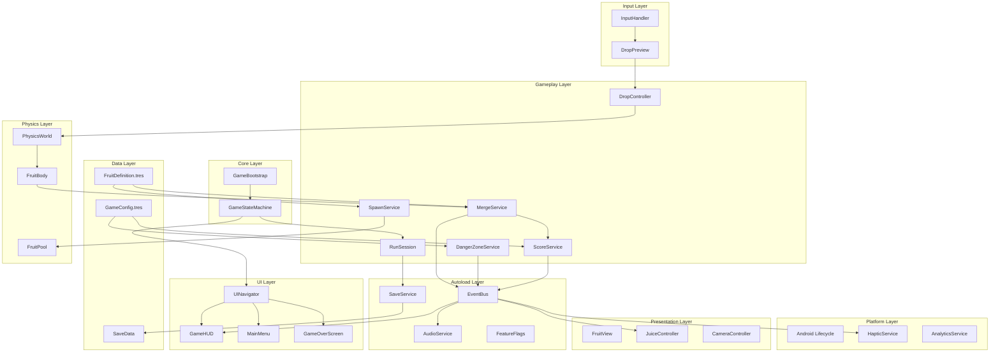
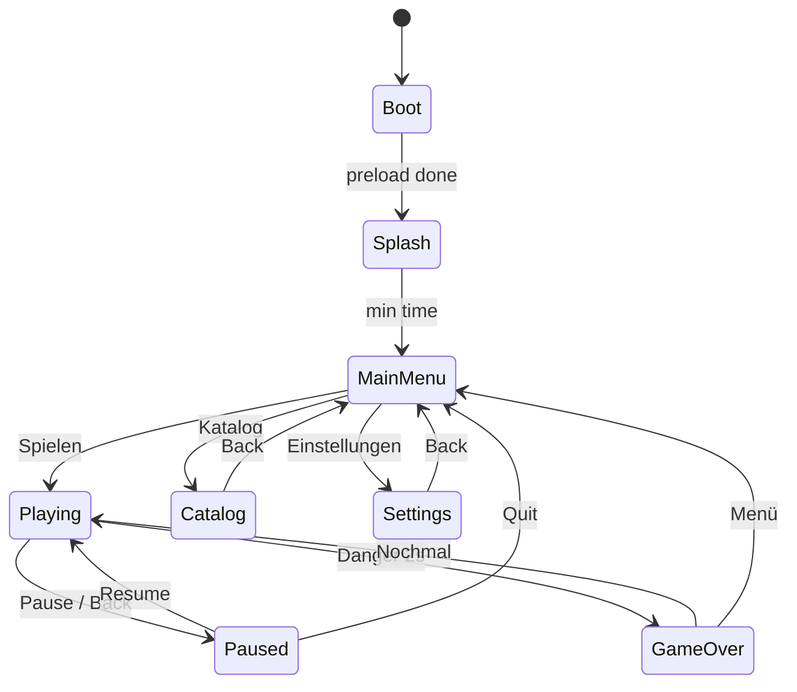
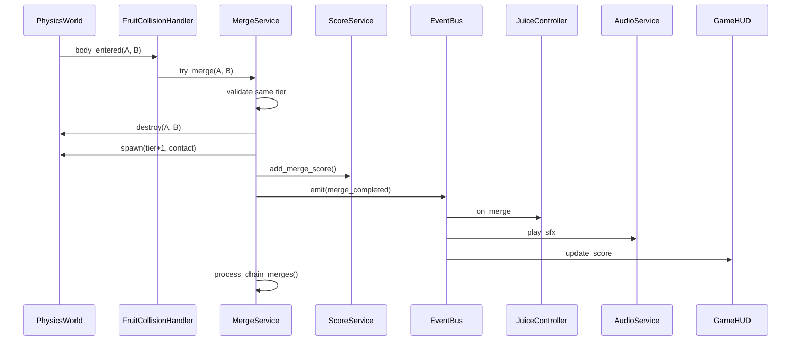

# Technical Design Document (TDD) — Softwarearchitektur

| | |
|---|---|
| **Projekt** | Frucht Kombinierer |
| **Plattform** | Android (Mobile) |
| **Engine** | Godot 4.x |
| **Sprache** | GDScript |
| **Version** | 1.1 |
| **Status** | Approved |
| **Basis** | [PRD.md](./PRD.md) (Approved) |
| **Vorgänger** | TDD v1.0 (Unity 6) — ersetzt |
| **Autor** | Principal Software Architect |
| **Datum** | 14. Juli 2026 |

---

## Inhaltsverzeichnis

1. [Architekturprinzipien](#1-architekturprinzipien)
2. [Modulübersicht](#2-modulübersicht)
3. [UML-Architekturdiagramm](#3-uml-architekturdiagramm)
4. [Interfaces & Contracts](#4-interfaces--contracts)
5. [Klassen & Nodes](#5-klassen--nodes)
6. [Game States](#6-game-states)
7. [Event System](#7-event-system)
8. [Datenfluss](#8-datenfluss)
9. [Asset Management](#9-asset-management)
10. [Input](#10-input)
11. [Rendering](#11-rendering)
12. [Audio](#12-audio)
13. [Savegame](#13-savegame)
14. [Physics](#14-physics)
15. [Merge System](#15-merge-system)
16. [UI](#16-ui)
17. [Service-Registrierung (Autoloads)](#17-service-registrierung-autoloads)
18. [Cross-Cutting Concerns](#18-cross-cutting-concerns)
19. [MVP vs. Release — Feature-Flags](#19-mvp-vs-release--feature-flags)
20. [Projektstruktur](#20-projektstruktur)
21. [Risiko-Mitigation](#21-risiko-mitigation)
22. [Tech-Stack](#22-tech-stack)
23. [Nächste Schritte](#23-nächste-schritte)
24. [Architekturentscheidungen](#24-architekturentscheidungen)

---

## 1. Architekturprinzipien

| Prinzip | Begründung (PRD-Bezug) |
|---------|------------------------|
| **Scene Tree + Event-Driven** | Gameplay von UI/Audio/Juice entkoppeln — Signals & EventBus (§14 Juice Matrix) |
| **Data-Driven via Custom Resources** | 11 Frucht-Stufen, Spawn-Gewichte, Scoring — Balancing im Editor ohne Code (§5.2, §8, §10) |
| **Deterministische Physik-Schicht** | `physics_ticks_per_second = 60`, Continuous CD — Risiko R2 (§10.2, §15) |
| **Autoload-Services mit klaren Contracts** | Testbarkeit, Feature-Flags für MVP/Release (§19 vs §20) |
| **Object Pooling überall** | Max. 40 RigidBody2D, 200 Partikel — Performance (§10.2, §14.2, §15) |
| **Offline-first Persistence** | `user://` JSON-Save; Cloud Save Post-Release (§16, §19.3) |
| **Git-freundlich** | `.gd`, `.tscn`, `.tres` als Text — Cursor-Workflow ohne Editor-Zwang |

### Migration von Unity — was sich ändert

| Unity (v1.0) | Godot 4 (v1.1) |
|--------------|----------------|
| VContainer | Autoload-Singletons |
| ScriptableObjects | Custom Resources (`.tres`) |
| UGUI | Control Nodes + CanvasLayer |
| Physics2D | Godot Physics / RigidBody2D |
| Addressables | `res://` MVP → Export-Packs Release |
| UniTask | `await` / Coroutines |
| Unity Localization | TranslationServer + CSV |

**Spiel-Logik unverändert:** Merge, Danger Zone, Scoring, Spawn-Gewichte bleiben 1:1 aus dem PRD.

---

## 2. Modulübersicht

```
frucht-kombinierer/
├── autoload/                # Globale Services (EventBus, Save, Audio, …)
├── scripts/
│   ├── core/                # Bootstrap, State Machine, Feature Flags
│   ├── gameplay/            # Drop, Spawn, Merge, Danger Zone, Scoring
│   ├── physics/             # Fruit Body, Collision, Pool
│   ├── presentation/        # Juice, Camera Shake, Particles
│   ├── input/               # Touch, Android Back, Accessibility
│   ├── ui/                  # Screens, HUD, Navigation
│   ├── meta/                # Katalog, Stats, Daily Challenge (Release)
│   └── persistence/         # Save/Load, Settings
├── resources/               # FruitDefinition.tres, Configs
├── scenes/
│   ├── boot/
│   ├── game/
│   ├── ui/
│   └── fruits/
├── assets/                  # Sprites, Audio, Fonts
└── tests/                   # GdUnit4
```

### Entscheidung: Modul-Schnitt

| Alternative | Pro | Contra | Empfehlung |
|-------------|-----|--------|------------|
| **Alles in einer Scene** | Schnellster Prototyp | Unwartbar ab Tier 3 | ❌ |
| **Modular (oben)** | Klare Grenzen, testbar | Initialer Aufbau | ✅ |
| **Voll-ECS (gecox etc.)** | Performance | Overkill für 40 Bodies | ❌ |

---

## 3. UML-Architekturdiagramm

### 3.1 Komponentendiagramm



### 3.2 Klassendiagramm (Kern-Domäne)

```mermaid
classDiagram
    direction TB

    class GameState {
        <<abstract>>
        +enter() void
        +exit() void
        +process(delta) void
    }

    class GameStateMachine {
        -current_state: GameState
        +transition_to(state) void
    }

    class EventBus {
        +emit(event_name, data) void
        +subscribe(event_name, callable) void
        +unsubscribe(event_name, callable) void
    }

    class FruitDefinition {
        <<Resource>>
        +tier: int
        +radius: float
        +mass: float
        +score_on_merge: int
        +sprite: Texture2D
        +scene: PackedScene
    }

    class MergeService {
        +try_merge(a, b) MergeResult
        +is_mergeable(a, b) bool
        +process_chain_merges() void
    }

    class DropController {
        +can_drop: bool
        +preview_x: float
        +drop() void
    }

    class SpawnService {
        +current_fruit: int
        +next_fruit: int
        +roll_next() void
    }

    class ScoreService {
        +current_score: int
        +combo_multiplier: float
        +add_merge_score(tier, position) void
    }

    class DangerZoneService {
        +danger_level: float
        +is_game_over: bool
        +evaluate(fruits) void
    }

    class PhysicsWorld {
        +spawn_fruit(tier, pos) FruitBody
        +destroy_fruit(body) void
        +set_simulation_active(active) void
    }

    class SaveService {
        +load() SaveData
        +save(data) void
    }

    class InputHandler {
        +pointer_position: Vector2
        +is_dragging: bool
        +was_released: bool
    }

    class RunSession {
        +run_id: String
        +score: int
        +highest_tier: int
        +merge_count: int
        +end_run() void
    }

    GameStateMachine --> GameState
    MergeService --> FruitDefinition
    DropController --> SpawnService
    DropController --> PhysicsWorld
    ScoreService --> RunSession
    DangerZoneService --> RunSession
```



---

## 4. Interfaces & Contracts

Godot hat keine Java-style Interfaces; Contracts werden über **duck typing**, **class_name**-Basisklassen und **explizite Methodennamen** definiert.

### 4.1 Core Contracts

| Contract | Methoden |
|----------|----------|
| `GameState` (base class) | `enter()`, `exit()`, `process(delta)` |
| `GameStateMachine` | `transition_to(state)`, `current_state` |
| `EventBus` (Autoload) | `emit(event, data)`, `subscribe()`, `unsubscribe()` |
| `FeatureFlags` (Autoload) | `is_enabled(feature: String) -> bool` |

### 4.2 Gameplay Contracts

| Contract | Methoden |
|----------|----------|
| `SpawnService` | `current_fruit`, `next_fruit`, `roll_next()`, `apply_pity()` |
| `DropController` | `can_drop`, `set_preview_x()`, `drop()`, `cooldown_remaining` |
| `MergeService` | `try_merge(a, b)`, `process_chain_merges()` |
| `ScoreService` | `add_merge_score()`, `combo_multiplier`, `reset()` |
| `DangerZoneService` | `evaluate()`, `danger_progress` (0–1), `reset()` |
| `RunSession` | `start()`, `end()`, `score`, `stats` |
| `ComboTracker` | `register_merge()`, Fenster 1,5 s, max ×2,0 |

### 4.3 Physics Contracts

| Contract | Methoden |
|----------|----------|
| `PhysicsWorld` | `spawn_fruit()`, `destroy_fruit()`, `clear()`, `set_active()` |
| `FruitBody` (Node) | `tier`, `is_settled`, `is_in_danger_zone`, `is_merging` |
| `FruitPool` | `acquire(tier)`, `release(body)` |

### 4.4 Presentation Contracts

| Contract | Methoden |
|----------|----------|
| `FruitView` | `play_drop()`, `play_merge()`, `play_idle()`, `set_ghost()` |
| `JuiceController` | `on_drop()`, `on_merge()`, `on_combo()`, `on_danger()`, `on_gold()` |
| `CameraController` | `shake(intensity)`, `game_over_zoom()` |
| `ParticlePool` | `emit(config, position)` |

### 4.5 Input Contracts

| Contract | Methoden |
|----------|----------|
| `InputHandler` | `pointer_position`, `is_dragging`, `was_released` |
| `DropPreview` | `map_screen_to_drop_x()`, `show_ghost()` |
| `AndroidBackHandler` | `_notification(WMC_GO_BACK_REQUEST)` |

### 4.6 UI Contracts

| Contract | Methoden |
|----------|----------|
| `UINavigator` | `push(screen)`, `pop()`, `replace(screen)` |
| `Screen` (base Control) | `show_screen()`, `hide_screen()`, `on_back()` |

### 4.7 Persistence Contracts

| Contract | Methoden |
|----------|----------|
| `SaveService` (Autoload) | `load()`, `save()`, `get_settings()` |
| `CatalogRepository` | `discover_tier()`, `get_discovered()`, `persist()` |

---

## 5. Klassen & Nodes

### 5.1 Core

| Klasse / Node | Typ | Verantwortung |
|---------------|-----|---------------|
| `GameBootstrap` | Node | Scene-Entry, initialisiert Run, lädt Configs |
| `GameStateMachine` | Node / Autoload | State-Transitions |
| `BootState` | GameState | Asset-Preload |
| `SplashState` | GameState | Min. Anzeigezeit |
| `MainMenuState` | GameState | Menü-Musik |
| `PlayingState` | GameState | Physik aktiv |
| `PausedState` | GameState | Physik frozen |
| `GameOverState` | GameState | Run-Ende, Save |
| `FeatureFlags` | Autoload | MVP/Release Gates |

### 5.2 Gameplay

| Klasse | Verantwortung |
|--------|---------------|
| `RunSession` | Laufzeit-State pro Run |
| `SpawnService` | Gewichtetes RNG (§5.5), Pity (Release) |
| `DropController` | Cooldown 300–500 ms post-Merge (§5.3) |
| `MergeService` | Gleich-Tier, Kettenreaktionen, Kontaktpunkt (§5.4) |
| `ScoreService` | Punkte-Tabelle (§8.1), Combo (§8.2) |
| `DangerZoneService` | 2,0 s Timer (§5.7) |
| `ComboTracker` | 1,5 s Fenster, max ×2,0 |

### 5.3 Physics

| Node | Verantwortung |
|------|---------------|
| `PhysicsWorld` (Node2D) | Fruit-Spawning, Simulation-Steuerung |
| `FruitBody` (RigidBody2D) | Tier-Daten, Collision, Sleep |
| `FruitCollisionHandler` | `body_entered` → MergeService |
| `FruitPool` | Pool für 11 Tier-Szenen |
| `ContainerBounds` (StaticBody2D) | Wände, Boden bounce 0,3 (§5.6) |
| `DangerLine` (Area2D) | Overlap-Detection für Danger Zone |

### 5.4 Custom Resources (`.tres`)

| Resource | Inhalt |
|----------|--------|
| `FruitDefinition` | tier, radius, mass, friction, sprite, sfx_id, juice_profile |
| `FruitDatabase` | Array aller 11 Definitionen |
| `SpawnConfig` | Gewichte 35/28/20/12/5 % (§5.5) |
| `ScoreConfig` | Punkte pro Merge-Stufe (§8.1) |
| `PhysicsConfig` | gravity, friction, bounce, sleep (§10.2) |
| `JuiceConfig` | Partikel, Shake pro Tier (§14) |

### 5.5 Presentation

| Node | Verantwortung |
|------|---------------|
| `FruitView` (Sprite2D + AnimationPlayer) | Squash-Stretch, Idle |
| `DropPreview` (Sprite2D) | Ghost-Silhouette (§6.2) |
| `JuiceController` | VFX + Shake + Haptic-Trigger |
| `GPUParticlesPool` | Max. 200 Partikel (§14.2) |
| `DangerLineView` (Line2D) | Puls 1 Hz (§13) |

### 5.6 UI Screens (Control)

| Screen | PRD-Referenz |
|--------|--------------|
| `SplashScreen` | Cold Start < 3 s (§15) |
| `MainMenuScreen` | §11.2 |
| `GameHUD` | Score, Rekord, Pause (§11.3) |
| `PauseOverlay` | §6.1 |
| `GameOverScreen` | Score, Stats, CTAs (§7.3) |
| `CatalogScreen` | 11 Einträge (§9.2) |
| `SettingsScreen` | Audio, Vibration (§12.3) |

### 5.7 Persistence

| Klasse | Verantwortung |
|--------|---------------|
| `SaveData` | Resource/Dictionary — Highscore, Catalog, Stats, Settings |
| `SaveService` (Autoload) | JSON read/write nach `user://save.json` |
| `SaveMigration` | Schema v1 → v2 |

---

## 6. Game States



| State | Physik | Input | Audio |
|-------|--------|-------|-------|
| `Boot` | Aus | Nein | Nein |
| `Splash` | Aus | Nein | Optional |
| `MainMenu` | Aus | UI | Menü-Musik (§12.2) |
| `Playing` | An | Drop + Pause | Ingame-Ambient |
| `Paused` | Aus (`set_deferred`) | UI | Duck Music |
| `GameOver` | Aus | UI | Fade-out 1 s (§12.2) |

### Entscheidung: Scene-Wechsel vs. Overlays

| Alternative | Pro | Contra | Empfehlung |
|-------------|-----|--------|------------|
| `change_scene_to_file()` pro Screen | Einfach | Physik-Scene-Verlust | ❌ |
| **Eine Game-Scene + UI-Overlays** | Schnell, Physik bleibt | State-Logik nötig | ✅ |
| Sub-Viewport pro Modus | Isoliert | Komplex | ⚠️ Release (Daily Challenge) |

**Empfehlung:** `scenes/game/game.tscn` als Haupt-Scene; UI als `CanvasLayer`-Kinder.

---

## 7. Event System

### 7.1 Domain Events

```
Gameplay:
  fruit_dropped(tier, position)
  merge_started(tier_a, tier_b, contact_point)
  merge_completed(result_tier, position, score, combo_multiplier)
  combo_increased(multiplier) / combo_broken()
  danger_entered(fruit_id) / danger_exited(fruit_id)
  danger_escalated(progress)
  game_over_triggered(reason)
  new_high_score(score)
  fruit_discovered(tier)

System:
  game_state_changed(from, to)
  settings_changed(settings)
  run_started(run_id) / run_ended(stats)
```

### 7.2 Architektur: Signals + EventBus

| Mechanismus | Einsatz |
|-------------|---------|
| **Godot Signals** | Lokal: FruitBody → MergeService, UI-Buttons |
| **EventBus Autoload** | Global: Merge → Juice, Audio, HUD, Katalog |

### Entscheidung

| Alternative | Pro | Contra | Empfehlung |
|-------------|-----|--------|------------|
| Nur Signals | Godot-native | Signal-Spaghetti global | ❌ |
| Nur EventBus | Zentral | Lokale Kopplung unnötig indirekt | ❌ |
| **Signals lokal + EventBus global** | Best of both | Zwei Patterns | ✅ |
| Custom Observer-Klassen | Testbar | Boilerplate | ⚠️ für Unit-Tests |

### 7.3 Event-Flow (Merge)



---

## 8. Datenfluss

### 8.1 Drop-Loop

```
InputHandler → DropPreview → DropController
    → [release] SpawnService.current_fruit
    → PhysicsWorld.spawn_fruit()
    → SpawnService.roll_next()
    → EventBus: fruit_dropped
    → JuiceController + AudioService
```

### 8.2 Run-Lifecycle

```
MainMenu → RunSession.start()
    → SpawnService.reset()
    → PhysicsWorld.clear()
    → ScoreService.reset()
    → DangerZoneService.reset()
    → StateMachine → Playing

GameOver → RunSession.end()
    → SaveService.update_highscore()
    → CatalogRepository.persist()
    → Analytics.log_session()
    → GameOverScreen.show(stats)
```

### 8.3 Config-Datenfluss

```
resources/*.tres (Editor)
    → Preload in Services (_ready)
    → Runtime immutable (duplicate() bei Kopien)
```

### 8.4 State-Zuordnung

| State | Ort | Warum |
|-------|-----|-------|
| Laufzeit | `RunSession` + `PhysicsWorld` | Ephemeral |
| Meta | `SaveData` via `SaveService` | Persistent (`user://`) |
| Settings | `SaveService.settings` | Sofort persistiert |
| Config | Custom Resources | Designer-Balancing |

---

## 9. Asset Management

### 9.1 Strategie

| Phase | Lösung | Begründung |
|-------|--------|------------|
| **MVP** | Direkte `res://`-Referenzen in Scenes + `preload()` | Schnell, kleine APK (§19, §15) |
| **Release** | Resource-Packs / Export-Filter | Korb-Skins, FR/ES (§20) |

### 9.2 Asset-Kategorien

```
assets/
├── fruits/          # 11 Sprites + Animations
├── container/       # Korb, Wände
├── vfx/             # Partikel-Scenes
├── audio/           # SFX + Music (.ogg)
├── ui/              # UI-Atlas, Nunito-Font
└── localization/    # DE, EN CSV
```

### 9.3 Preload (Splash)

`BootState` preloaded: Fruit Tier 1–5 Scenes, Core-SFX, UI-Theme.

### Entscheidung

| Alternative | Empfehlung |
|-------------|------------|
| Alles lazy | ❌ — Lags beim ersten Drop |
| **Preload Core + lazy Rest** | ✅ |
| ResourceLoader threaded (Release) | ⚠️ |

---

## 10. Input

### 10.1 Pipeline

```
InputEventScreenTouch / Drag
    → InputHandler._input()
    → DropPreview.map_to_drop_x()
    → DropController (release → drop)
```

### 10.2 Klassen

| Klasse | Aufgabe |
|--------|---------|
| `InputHandler` | Touch Down/Move/Up |
| `DropPreview` | Ghost-Position, Clamping |
| `AndroidBackHandler` | `NOTIFICATION_WM_GO_BACK_REQUEST` → Pause |

### 10.3 Accessibility

`AccessibilitySettings` Resource: +20 % Touch-Zonen, reduzierter Shake (§6.3).

### Entscheidung

| Alternative | Empfehlung |
|-------------|------------|
| `_input()` global | ✅ Einfach, präzise |
| InputMap Actions | ⚠️ Für Pause/Button ok |
| TouchScreenButton für Drop | ❌ — Drag nötig |

---

## 11. Rendering

### 11.1 Setup

| Aspekt | Entscheidung | PRD |
|--------|--------------|-----|
| Renderer | **Mobile** (Project Settings) | §15 Budget-Geräte |
| Kamera | Camera2D, Orthographic, Portrait | §5.1 |
| Stretch | `canvas_items`, Expand | Responsive 9:16 |
| Particles | GPUParticles2D | §14.2 |
| Post-FX | ColorRect Vignette (Danger) | §14 |

### 11.2 Klassen

| Node | Aufgabe |
|------|---------|
| `GameCamera` (Camera2D) | Zoom, Shake, Game-Over-Zoom |
| `SafeAreaMargin` (MarginContainer) | Notch + Nav Bar (§11.4) |
| `DangerVignette` (ColorRect) | Rot bei Danger |

### Entscheidung: 2D vs. Compatibility

**Forward+ Mobile Renderer** — Godot 4 Standard, gut für Partikel und UI.

---

## 12. Audio

### 12.1 Architektur

```
Master Bus
├── SFX Bus     → AudioStreamPlayer-Pool (8–16)
├── Music Bus   → 1–2 StreamPlayers
└── UI Bus      → UI-Klicks
```

### 12.2 Klassen

| Klasse | Aufgabe |
|--------|---------|
| `AudioService` (Autoload) | `play_sfx()`, `play_music()`, Bus-Volumes |
| `SfxPool` | Wiederverwendbare `AudioStreamPlayer` |
| `MusicController` | Crossfade Menu ↔ Ingame ↔ GameOver |

### Entscheidung

| Alternative | Empfehlung |
|-------------|------------|
| Neuer Player pro Sound | ❌ |
| **Pooled Players + SfxLibrary.tres** | ✅ |
| FMOD/Wwise GDExtension | ❌ — Overkill MVP |

---

## 13. Savegame

### 13.1 Schema (`user://save.json`)

```json
{
  "version": 1,
  "high_score": 12500,
  "catalog": {
    "discovered_tiers": [1, 2, 3, 4, 5],
    "counts": {}
  },
  "lifetime_stats": {
    "total_runs": 42,
    "total_merges": 380,
    "golden_fruits": 0
  },
  "settings": {
    "master_volume": 1.0,
    "sfx_volume": 1.0,
    "music_volume": 0.8,
    "haptics_enabled": true,
    "large_touch_zones": false,
    "reduced_shake": false,
    "color_blind_mode": false
  },
  "last_played_at": "2026-07-14T10:00:00Z"
}
```

### 13.2 Klassen

| Klasse | Aufgabe |
|--------|---------|
| `SaveData` | Typed Dictionary / Resource |
| `SaveService` | Atomic write (tmp + rename) |
| `SaveMigration` | Version upgrades |

### 13.3 App-Pause (PRD §7.1)

`NOTIFICATION_APPLICATION_PAUSED` → PausedState + Timestamp. Rückkehr < 5 Min. → Resume; sonst Run verwerfen.

### Entscheidung

| Alternative | Empfehlung |
|-------------|------------|
| ConfigFile (Godot) | ⚠️ — flache Struktur |
| **JSON + FileAccess** | ✅ Lesbar, versionierbar |
| ResourceSaver | ❌ — nicht für User-Daten |

---

## 14. Physics

### 14.1 Project Settings

| Parameter | Wert | Quelle |
|-----------|------|--------|
| `physics_ticks_per_second` | 60 | §13, §15 |
| `2d/default_gravity` | 980 (Godot default) | §10.2 |
| RigidBody2D `continuous_cd` | 2 (CAST) | Risiko R2 |
| Max Bodies | 40 (Soft Cap) | §10.2 |
| Boden `physics_material_override` | bounce 0,3 | §5.6 |
| Friction | 0,4 | §10.2 |

### 14.2 FruitBody Setup

```
FruitBody (RigidBody2D)
├── CollisionShape2D (CircleShape2D — radius aus FruitDefinition)
├── Sprite2D
├── FruitCollisionHandler (script)
└── AnimationPlayer
```

- `contact_monitor = true`, `max_contacts_reported = 4`
- `can_sleep = true` — Sleep nach Ruhe (§10.2)
- `lock_rotation` optional pro Tier (Traube rollend)

### 14.3 Architektur

```
PhysicsWorld (_physics_process)
    → FruitCollisionHandler.body_entered
    → MergeService.try_merge()
    → DangerZone (Area2D) overlap monitoring
```

### Entscheidung

| Alternative | Empfehlung |
|-------------|------------|
| Area2D für Merge-Detection | ❌ — braucht solid collision |
| **RigidBody2D + body_entered** | ✅ |
| CharacterBody2D | ❌ — kein realistisches Rollen |

---

## 15. Merge System

### 15.1 Pipeline

```
1. body_entered (Physics)
2. MergeService.can_merge(A, B):
   - Same tier?
   - Not already merging?
   - Not preview/held fruit?
   - Result tier ≤ 11?
3. Lock both (is_merging = true)
4. Contact point: collision.get_position()
5. EventBus: merge_started
6. Pre-Merge tween (0,1 s) — parallel
7. FruitPool.release(A, B)
8. Spawn result at contact + slight upward impulse
9. ScoreService.add_merge_score()
10. EventBus: merge_completed
11. CatalogRepository.discover if new
12. DropController.start_cooldown(300–500 ms)
13. process_chain_merges() — Queue im selben Physics-Tick
```

### 15.2 Kettenreaktionen

`MergeService._merge_queue: Array` — max. Tiefe 10 pro Tick.

### 15.3 Goldene Frucht (Tier 11)

`GoldMergeProfile.tres` — 0,6 s Animation, Screen-Flash, Fanfare.

### Entscheidung

| Alternative | Empfehlung |
|-------------|------------|
| Merge in `_process` | ❌ — Race Conditions |
| **Merge in `_physics_process` / nach body_entered** | ✅ |
| Deferred call | ⚠️ Nur für Destroy |

---

## 16. UI

### 16.1 Screen-Map (PRD §11.1)

```
Splash → Hauptmenü → Classic Game → Pause → Game Over
                  ↘ Einstellungen
                  ↘ Frucht-Katalog
```

### 16.2 Struktur

```
GameRoot (Node2D)
├── World (Container, Fruits, Camera)
└── UI (CanvasLayer)
    ├── HUD
    ├── PauseOverlay (hidden)
    └── GameOverOverlay (hidden)

MainMenu (separate Scene oder Overlay)
```

### 16.3 HUD-Elemente (§11.3)

| Element | Control |
|---------|---------|
| Score | Label (oben links) |
| Rekord | Label (oben rechts) |
| Pause | TextureButton (44×44 dp min.) |
| Combo | ProgressBar (dezent) |
| Nächste Frucht | TextureRect (Release) |

### Entscheidung: Control Nodes vs. andere UI

| | Control Nodes | 3D/UI in Viewport |
|--|---------------|-------------------|
| MVP | ✅ Standard | ❌ |
| **Empfehlung** | ✅ **Control + Theme** | — |

`Theme.tres` — warme Palette, 12 px Corner Radius, Nunito-Font (§11.4).

---

## 17. Service-Registrierung (Autoloads)

`project.godot` Autoloads:

| Name | Script | Zweck |
|------|--------|-------|
| `EventBus` | `event_bus.gd` | Globale Domain Events |
| `SaveService` | `save_service.gd` | Persistenz |
| `AudioService` | `audio_service.gd` | SFX + Music |
| `FeatureFlags` | `feature_flags.gd` | MVP/Release |
| `GameStateMachine` | `game_state_machine.gd` | State-Transitions |

### Entscheidung: DI-Framework vs. Autoloads

| Alternative | Pro | Contra | Empfehlung |
|-------------|-----|--------|------------|
| VContainer (Unity) | — | Nicht verfügbar | ❌ |
| **Autoloads** | Godot-idiomatisch, einfach | Globale State | ✅ **MVP** |
| Pure Get-Node | Lokal | Service-Discovery chaotisch | ❌ |
| DI-Addon (beehave etc.) | Formal | Overhead | ❌ |

Gameplay-Services (`MergeService`, `SpawnService`) leben als **Kinder von GameBootstrap** in der Game-Scene — nicht als Autoload (Run-Scope).

---

## 18. Cross-Cutting Concerns

### 18.1 Analytics (MVP: Firebase GDExtension oder HTTP)

```
AnalyticsService.log_event("run_end", { score, duration, highest_tier })
```

### 18.2 Localization

`TranslationServer` + CSV in `assets/localization/`:
- `strings.de.csv`, `strings.en.csv`
- `tr("KEY")` in UI-Scripts

### 18.3 Haptics

```gdscript
Input.vibrate_handheld(duration_ms)  # Android
```
Drop: 8 ms · Merge: 25 ms (§6.2)

### 18.4 Quality Settings (Release)

`JuiceConfig` Varianten: particles_low / medium / high (§20).

---

## 19. MVP vs. Release — Feature-Flags

| Feature | Flag | MVP Default |
|---------|------|-------------|
| Dual Preview | `dual_preview` | `false` |
| Pity System | `pity_spawn` | `false` |
| Daily Challenge | `daily_challenge` | `false` |
| Achievements | `achievements` | `false` |
| Share Card | `share` | `false` |

`FeatureFlags` Resource — kein `#ifdef`.

---

## 20. Projektstruktur

```
Frucht Kombinierer/
├── project.godot
├── export_presets.cfg
├── scenes/
│   ├── boot/boot.tscn
│   ├── game/game.tscn
│   ├── fruits/fruit_body.tscn
│   ├── ui/main_menu.tscn
│   ├── ui/game_hud.tscn
│   ├── ui/pause_overlay.tscn
│   ├── ui/game_over.tscn
│   ├── ui/catalog.tscn
│   └── ui/settings.tscn
├── scripts/
│   ├── autoload/
│   ├── core/
│   ├── gameplay/
│   ├── physics/
│   ├── presentation/
│   ├── input/
│   ├── ui/
│   ├── meta/
│   └── persistence/
├── resources/
│   ├── fruits/          # fruit_01_cherry.tres … fruit_11_gold.tres
│   ├── spawn_config.tres
│   ├── score_config.tres
│   ├── physics_config.tres
│   └── feature_flags.tres
├── assets/
├── tests/
│   └── unit/
└── docs/
```

---

## 21. Risiko-Mitigation

| PRD-Risiko | Godot-Antwort |
|------------|---------------|
| R2 Physik-Instabilität | 60 Hz Physics, Continuous CD, Merge-Lock, Chain-Queue |
| R3 Performance Budget | Mobile Renderer, Object Pooling, GPUParticles Limit |
| R7 Scope Creep | FeatureFlags, modulare Scripts |
| R5 RNG-Frust | SpawnService mit austauschbarer Pity-Strategy |

---

## 22. Tech-Stack

| Bereich | Wahl |
|---------|------|
| Engine | Godot 4.x (4.3+) |
| Sprache | GDScript |
| Render | 2D Forward+ Mobile |
| Physics | RigidBody2D (Godot Physics) |
| Services | Autoloads + Scene-Scoped Nodes |
| UI | Control Nodes + Theme |
| Config | Custom Resources (`.tres`) |
| Assets MVP | `res://` Direct References |
| Assets Release | Export Resource Packs |
| Async | `await` / Coroutines |
| Save | JSON → `user://` |
| Events | Signals + EventBus Autoload |
| Tests | GdUnit4 |
| Analytics | Firebase (GDExtension) — Ende MVP |
| Localization | TranslationServer + CSV |
| IDE | Godot Editor + Cursor (godot-tools) |

---

## 23. Nächste Schritte

1. Godot-Projekt anlegen (`project.godot`)
2. Ordnerstruktur + Autoloads
3. Custom Resources (FruitDefinition, Configs)
4. Vertical Slice: Drop → Merge (1→2) → Score
5. Danger Zone + Game Over
6. Alle 11 Tiers + Katalog + UI + Save + Juice
7. Android Export + Performance-Test

---

## 24. Architekturentscheidungen

| # | Thema | Entscheidung | Begründung |
|---|-------|--------------|------------|
| 1 | Engine | **Godot 4.x** | Open Source, kein Hub, git-freundlich, 2D-Physik |
| 2 | Sprache | **GDScript** | Godot-native, schnelle Iteration, kein .NET-Setup |
| 3 | Services | **Autoloads** | Godot-idiomatisch statt VContainer |
| 4 | Config | **Custom Resources** | Entspricht ScriptableObjects, Editor-Support |
| 5 | UI | **Control Nodes** | Standard-Godot-UI, Theme-System |
| 6 | Assets MVP | **Direct `res://` References** | Einfach, kleine APK |
| 7 | Events | **Signals + EventBus** | Lokal nativ, global entkoppelt |

*Freigegeben am 14. Juli 2026 — Migration von Unity 6 auf Godot 4.*

---

*Dokument erstellt von Principal Software Architect — Frucht Kombinierer*
